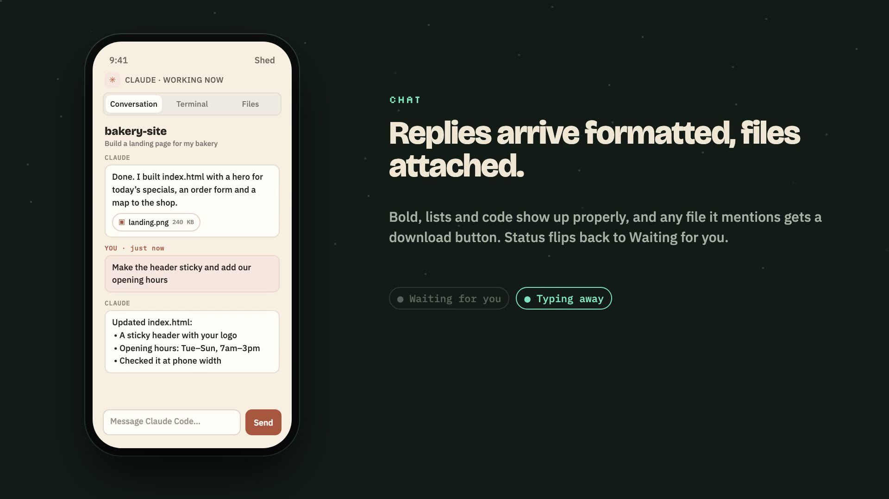

# Shed

*Powered by Laya.*

**Website:** https://shed-sigma.vercel.app

[](https://shed-sigma.vercel.app/#tour)

▶ [Watch the 80-second tour](https://shed-sigma.vercel.app/#tour) · [Download the video (MP4)](https://shed-sigma.vercel.app/shed-tour.mp4)

A local, internet-accessible task plane for desktop coding agents. It shows sessions that are currently open in Codex, Claude Code, Gemini, Pi, and OpenCode, refreshes their transcripts, and lets you continue them from a browser. You can also start a completely new coding session from a phone when no desktop session exists.

## Open it

The server starts automatically when this Mac signs in. Open `http://localhost:4378` on the Mac once and choose **Set a password for the first time**. From any Wi-Fi or cellular network, use the HTTPS address shown under **Settings → Phone access** and sign in with that password.

The Mac must stay awake and connected to the internet. The Cloudflare Quick Tunnel URL can change when the tunnel restarts. Its current value is stored in `.jev-data/remote-url`. A named Cloudflare Tunnel is needed for a permanent hostname.

To run it manually:

```bash
npm start
```

## Local Laya routing

Routing uses the open-source [Laya decision model](https://github.com/NandhaKishorM/laya) through the [`@receptron/laya`](https://github.com/receptron/laya) ONNX runtime. It runs on this Mac and requires no TypeSafe account or API key. The first launch downloads about 1.7 GB of model files to `~/.cache/receptron-laya`; later launches reuse the cache.

For a new prompt, Laya chooses a healthy installed harness and then a model from that harness's enabled roster.

Follow-ups always stay in the existing session's harness. Laya chooses only a model from that harness's enabled roster, preferring the current model and keeping it as the fallback when unsure. Open Terminal sessions and queued Codex sessions keep their current model because those delivery paths cannot apply a per-message model choice. If the current harness is unavailable, Shed reports the problem instead of automatically switching. You can still explicitly choose **Hand off to …** to start a new session in another harness with the recent transcript (up to 16 messages, about 12k characters); this does not carry native context. The drawer previews the selected route and model without starting a task.

To move a conversation yourself, pick **Hand off to …** in the session drawer. The new harness starts a session in the same project with the topic, the last 16 messages (about 12,000 characters), the path to the complete earlier transcript so it can read anything else it needs, and the project's uncommitted git changes. If the new window never takes the message, Shed sends it back to the original session and tells you. A new window that stops at a startup question (trust this folder, install an update) is reported as waiting, and its task drawer has a Terminal tab for answering it.

Harness health is checked about once a minute by starting each CLI and inspecting its login or provider configuration. A harness that needs sign-in stays visible with its reason, but is excluded from automatic routing for new sessions. These checks do not send a model prompt or consume tokens. If Laya is still loading or its confidence is low, deterministic local matching and the configured fallback model keep the task plane usable.

Configure harness model IDs, descriptions, enabled state, and fallback models in **Settings → Models by harness**.

## Start a session remotely

The command center's **New session** composer does not require an existing agent session. From a phone you can:

1. Enter a prompt.
2. Choose a harness or let Laya choose.
3. Choose an existing project, use the task plane workspace, or create a new named workspace under `~/Shed Workspaces`.
4. Start the session and watch its output in Activity and Live sessions.

## Live sessions

The **Live sessions** section identifies conversations held open by running harness processes. Codex transcripts are linked to their owning process directly. OpenCode can also provide busy state through its [local session API](https://dev.opencode.ai/docs/server/). The drawer refreshes every five seconds. Follow-ups to an open Codex session use `codex queue` so the task plane does not try to acquire a second writer for the same thread. A queued message stays marked **QUEUED** until Codex records the turn in that conversation. Queue acceptance alone does not mean the owning Codex process has started the turn; check the original conversation if it stays queued. Other harnesses accept follow-ups after their current turn finishes.

## Claude and Codex run in Terminal

Claude Code and Codex tasks run in a visible Terminal window on the Mac, not in a hidden process, so you can walk up to the Mac and see the session, and a reply keeps going if Shed restarts.

- **Session already open in Terminal:** the follow-up is typed into that tab. It runs with that session's own model and permissions, and Claude queues it if it is busy.
- **Session not open:** a new Terminal window runs `claude --resume` with the selected model. A new Claude session opens a new window the same way.
- **Permissions:** new windows use Claude's normal permissions, so Claude asks before editing files, running commands or using the web. Tick **Skip permissions** to start them with `--dangerously-skip-permissions` instead.
- **Terminal view:** the session drawer's **Terminal** tab shows that terminal's screen, updated every 2 seconds. Its input box types into the terminal, for example `1` to approve a permission prompt.

- **Codex:** a session not open anywhere resumes in a new window with `codex resume <id> --no-alt-screen` (so the Terminal view can read its output); a session open in the Codex desktop app still takes messages through `codex queue`. **Skip permissions** maps to `--dangerously-bypass-approvals-and-sandbox`.
- **Safety:** Shed only types into a window while the agent is that window's foreground program, and checks again before pressing Return. If the agent has exited, the half-typed line is cleared instead of being run by the shell, and the follow-up resumes in a new window.

Tasks follow the session transcript and finish when Claude goes idle or Codex records the turn as complete. The first time the background service controls Terminal, macOS asks on the Mac for permission (System Settings → Privacy & Security → Automation). Set `LAYA_HEADLESS_CLAUDE=1` or `LAYA_HEADLESS_CODEX=1` to go back to headless `claude -p` or `codex exec` runs.

## Security

Anyone who can reach your agents can run code on your Mac, so Shed needs both your password and a device you approved.

- **Only the secure link reaches Shed.** Shed listens on this Mac only; phones connect through the https tunnel. Plain-http access over Wi-Fi is off unless you start Shed with `SHED_LAN=1`.
- **Every device is approved on the Mac.** A sign-in from outside the Mac waits until you click **Approve** on the Mac, and your other devices get a notification about it. Scanning the QR code on the Mac skips the wait: it carries a one-time pairing code that expires after 10 minutes. Approving is only possible on the Mac, so a stolen phone session cannot let in more devices.
- **Each device has its own key.** Sign-ins get a random session key, stored only as a hash and expired after 30 idle days. **Settings → Devices** lists every device, with **Sign out** for each and **Sign out all other devices**.
- **Sign-in attempts are limited** per visitor (using Cloudflare's report of the real address) and in total per hour. After 20 failures in an hour, you get a notification.
- **Terminals only receive what they should.** Session controls accept only Stop, Mode, 1, 2, 3 and Enter, and only while the agent is running. Sign-in windows accept typing only while the login program runs. Messages are typed only while the agent is the window's foreground program.
- **The page cannot be framed** (`X-Frame-Options: DENY`, `frame-ancestors 'none'`), scripts only load from Shed itself, and no referrer is sent.

The master token in `.laya-token` only works for requests made directly on the Mac, never through the tunnel. For a permanent address and an extra login in front of Shed, use a named Cloudflare Tunnel with Cloudflare Access.

## Notifications

Settings → **Notifications** (or the banner on a phone) turns on push notifications for that device: one when a task finishes or stops, and one when an agent starts waiting for your OK. Tapping a notification opens that task or session. Shed checks for both every 10 seconds, whether or not anyone has it open.

Notifications use Web Push through `public/sw.js`, signed with keys Shed creates on first run (`.jev-data/push.json`). They need the https link: on iPhone, add Shed to the Home Screen first (iOS 16.4 or later) and turn notifications on from there. If the Cloudflare quick-tunnel address changes, turn notifications on again from the new address.

## Files

Each session's **Files** tab lists the newest videos, images, audio, PDFs and documents in its project folder, with an inline preview and a Download button. Replies that mention one of those files get download buttons underneath. Files are only served from inside the session's project folder (symlinks included), never from hidden folders or `node_modules`, and only to a signed-in browser.

## Harness support

| Harness | Discover sessions | Start tasks | Resume sessions |
| --- | --- | --- | --- |
| Codex | `~/.codex/sessions` | Installed `codex` CLI | `codex exec resume` |
| Claude Code | `~/.claude/projects` | Installed `claude` CLI | `claude --resume` |
| Gemini | `~/.gemini/tmp/*/chats` | Installed `gemini` CLI | `gemini --resume` |
| Pi | `~/.pi/agent/sessions` | Installed `pi` CLI | `pi --session` |
| OpenCode | `opencode session list --format json` | Installed `opencode` CLI | `opencode run --session` |

An absent CLI leaves file-backed history visible but disables sending tasks to that harness. OpenCode is installed on this Mac. Gemini sessions remain scoped to their original project.

Task data and service logs remain under `.jev-data` for compatibility with the existing installation. The user LaunchAgents are currently named `com.local.jev-task-plane` and `com.local.jev-task-plane-tunnel`; the application itself no longer calls TypeSafe or stores its API key.

## Check

```bash
npm test
```

The integration test uses an isolated home directory and a fake Codex CLI. Unit tests cover Laya choice validation, model routing, live-process matching, and model-roster validation without loading the production model.
